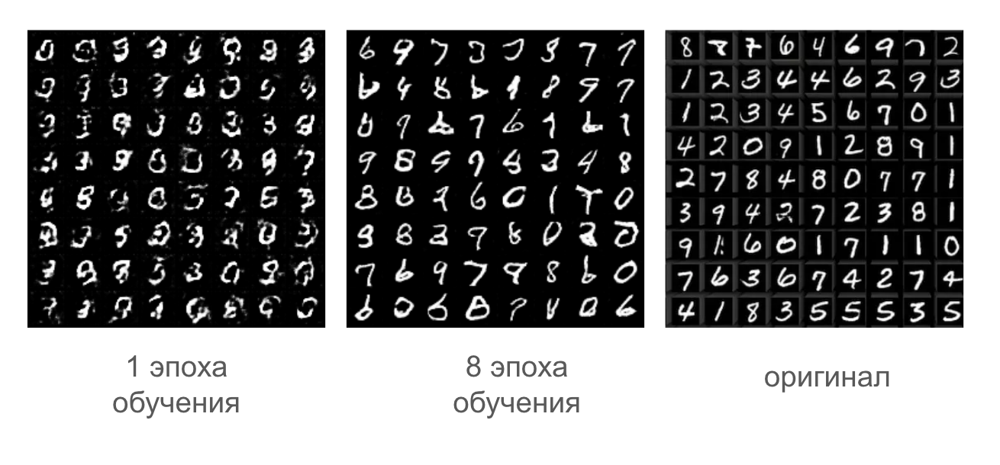

# 🖌️ MNIST GAN на PyTorch Lightning + ClearML
## 📌 О проекте



Реализация Generative Adversarial Network (GAN) для генерации рукописных цифр MNIST с использованием:
*   ⚡ <b>PyTorch</b> Lightning для структурированного обучения
*   📊 <b>ClearML</b> для трекинга экспериментов
*   🛠️ Гибкой конфигурации через аргументы командной строки

## 🚀 Запуск обучения
Установка
```bash
pip install torch torchvision lightning clearml
```

 Базовый запуск (без логирования)
 ```bash
 python train_gan.py \
    --epochs 100 \
    --debug_samples_epoch 5
```
С полным мониторингом
```bash
python train_gan.py \
    --epochs 200 \
    --clearml True \
    --debug_samples_epoch 10
```
## ⚙️ Аргументы запуска
| Аргумент               | Тип    | По умолчанию | Описание                                                                 |
|------------------------|--------|--------------|--------------------------------------------------------------------------|
| `--fast_dev_run`       | `bool` | `False`      | 🔧 Запуск на одном батче для быстрой отладки                             |
| `--clearml`            | `bool` | `False`      | 📊 Активирует логирование в ClearML (требует настройки API)              |
| `--epochs`             | `int`  | `10`          | 🔄 Количество эпох обучения                                              |
| `--debug_samples_epoch`| `int`  | `1`          | 🖼️ Частота сохранения сгенерированных примеров (в эпохах)                |

## 🏗️ Структура проекта
```text
gan-project/
├── 📂 models/         # Модели Generator и Discriminator
├── 📂 data/           # Загрузка и аугментация данных
├── 📂 outputs/        # Результаты и чекпоинты
├── 🚀 train_gan.py    # Основной скрипт обучения
└── 📜 README.md       # Этот файл
```
## 📈 Выходные данные
1. Генерируемые образцы (каждые N эпох):
```text
outputs/samples/
├── epoch_001.png
├── epoch_010.png
└── epoch_100.png
```
2. Графики обучения в ClearML:
   * Потери генератора/дискриминатора
   * Примеры сгенерированных цифр
3. Чекпоинты моделей:
```text
outputs/checkpoints/
├── generator_epoch=99.ckpt
└── discriminator_epoch=99.ckpt
```